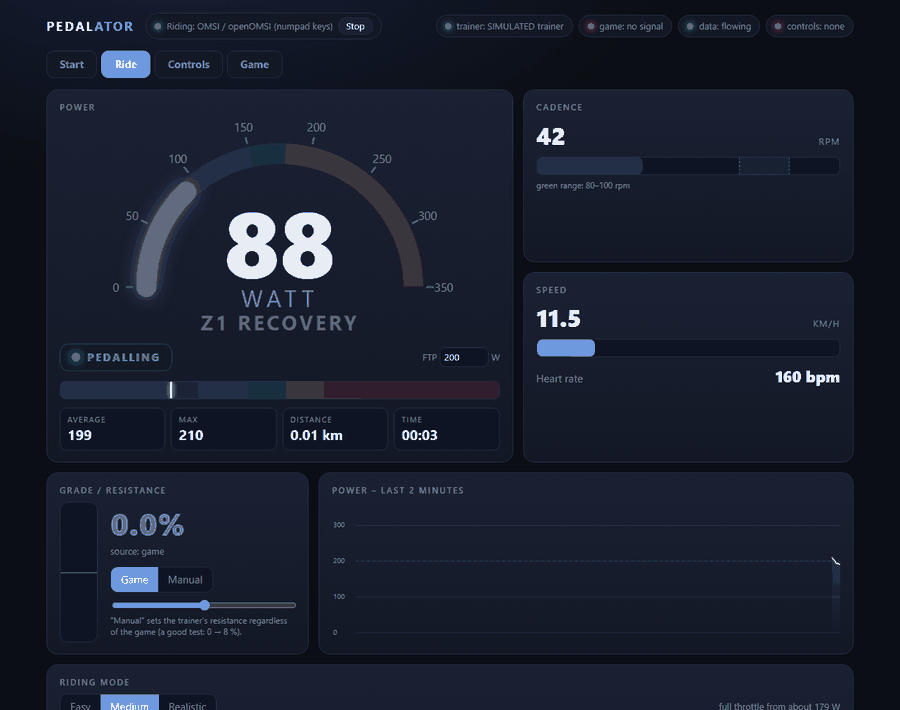
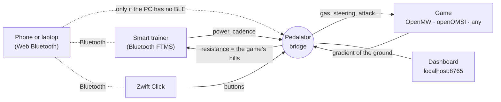

<div align="center">

# Pedalator

**Pedal through your games.** Use a smart trainer as a game controller: your pedalling moves the character or the vehicle, and the hills in the game push back through the trainer's resistance.

[](LICENSE)




*The dashboard, running with a simulated rider (`pedalator --simulate`) — no hardware needed to try it.*

[Polski](README.pl.md) · [Quick start](docs/quick-start.md) · [Documentation](#documentation) · [Roadmap](docs/roadmap.md)

</div>

---

## What it does

- **Pedalling is the gas.** Your power from a Bluetooth smart trainer drives the game: the harder you pedal, the faster you go.
- **Hills push back.** The game tells Pedalator how steep the ground is, and the trainer simulates it — climbs get heavy, descents get light.
- **Steer with Zwift Click.** The little Bluetooth controllers that come with the trainer turn the character, look up and down, attack, jump, draw a weapon, or use things.
- **No special PC hardware.** If your PC's Bluetooth cannot talk to a trainer, a phone or a laptop with Chrome does the Bluetooth part ([phone mode](docs/phone-mode.md)).
- **A dashboard** shows power, cadence, speed, grade, a two-minute history and a debug view, and lets you pick how easy the riding is.

> Born from riding **Morrowind** in [OpenMW](https://openmw.org) and a bus-simulator bicycle in [openOMSI](https://github.com/openOMSI-Project/openOMSI) on a Van Rysel D500 trainer — and open for any game you can connect to it.

## What works today

| | Tested on real hardware | Should work, not tested |
|---|---|---|
| **Trainer** | Van Rysel D500 (Bluetooth FTMS) | Any Bluetooth FTMS smart trainer that accepts simulated grade |
| **Controller** | Zwift Click v2 (both pucks) | Zwift Click v1 (two buttons: steer), Zwift Play / Ride |
| **Game** | OpenMW 0.51 (Morrowind) · openOMSI 0.1.6 (bus, bicycle) | Any game with keyboard controls ([`keys` target](docs/games/keys-and-udp.md)); any game that can send/receive UDP ([`udp` target](docs/games/keys-and-udp.md)) |
| **PC** | Windows 10 | Windows 11. Key output is Windows-only for now; the OpenMW target is otherwise portable |
| **Phone mode** | iPhone (iOS 18) with the Bluefy browser · Windows laptop with Chrome | Android with Chrome |

Pedalator is **alpha software**: it works for its author every day, but expect rough edges. Please open an issue if something does not work for you.

**Next up** ([roadmap](docs/roadmap.md#next-up)): the Click over the PC's own Bluetooth, a hybrid mode (trainer on the PC, Click on a laptop), profiles with remappable keys that you can import and export, a wizard for adding a new game, and Click + / − as a difficulty control.

## How it works



The **bridge** (`python -m pedalator`) is the middle: it reads the trainer, decides what the game should get, and sends the game's gradient back to the trainer. How it talks to a game depends on the game — see [Architecture](docs/architecture.md).

## Quick start

You need Python 3.10+ and, for the bike in OMSI, the HafenCity add-on (see [openOMSI](docs/games/openomsi.md)).

```bash
git clone https://github.com/arielkuzminski/pedalator
cd pedalator
python -m venv .venv && .venv\Scripts\activate      # optional but tidy
pip install -r requirements.txt
```

**1. Look around without any hardware**

```bash
python -m pedalator --simulate
```
Open <http://127.0.0.1:8765>. A made-up rider sprints and rests; try the riding modes and the resistance slider.

**2. Morrowind in OpenMW**

```bash
python -m pedalator install openmw          # copies the mod and enables it in openmw.cfg (a backup is made)
python -m pedalator --target openmw         # your PC talks to the trainer over Bluetooth LE
# or, if your PC cannot:
python -m pedalator --target openmw --remote   # then follow the phone-mode steps it prints
```
Start OpenMW, load a save, pedal. Details: [OpenMW guide](docs/games/openmw.md).

**3. A bus-simulator bicycle in openOMSI**

```bash
python -m pedalator install openomsi --game-dir "C:\path\to\openOMSI"
python -m pedalator build-bike --hafencity "...\Vehicles\HC_Fahrrad" --game-dir "C:\path\to\openOMSI"
python -m pedalator --keys
```
Details: [openOMSI guide](docs/games/openomsi.md).

**4. Any other game**: Pedalator can press the game's keys (`--keys`) or send JSON over UDP to a mod of yours: [keys and UDP](docs/games/keys-and-udp.md).

## Riding modes

Riding a game with no gears is hard work, so there are three modes (switch them on the dashboard while you ride):

| Mode | Full throttle from | Hills you feel |
|---|---|---|
| **Easy** (default) | ~125 W | 40 % |
| **Medium** | ~180 W | 70 % |
| **Realistic** | 250 W | 100 % |

Two sliders fine-tune the *power gain* and the share of the game's hills the trainer simulates.

## Zwift Click in OpenMW

| Button | Action |
|---|---|
| ◀ / ▶ (left puck) | turn left / right |
| ▲ / ▼ | look up / down |
| **B** (bottom of the right puck) | attack (hold for a charged blow) |
| **A** | jump |
| **Y** | draw / sheathe the weapon |
| **Z** | use / open / take / talk (presses the game's *use* key, `E` by default) |
| **−** / **+** | fewer / more of the game's hills on the trainer (difficulty) |

More in [Zwift Click](docs/zwift-click.md).

## Documentation

| | |
|---|---|
| [Quick start](docs/quick-start.md) | first ride in a few minutes |
| [Phone mode](docs/phone-mode.md) | iPhone, Android or a laptop as the Bluetooth radio; the one-time certificate step |
| [OpenMW / Morrowind](docs/games/openmw.md) · [openOMSI](docs/games/openomsi.md) · [Keys and UDP](docs/games/keys-and-udp.md) | per-game setup |
| [Zwift Click](docs/zwift-click.md) | buttons, how the protocol works |
| [Architecture](docs/architecture.md) | channels, ports, file formats |
| [Troubleshooting](docs/troubleshooting.md) · [FAQ](docs/faq.md) | when something is wrong |
| [Roadmap](docs/roadmap.md) | games and features that could come next (help wanted!) |
| [Development](docs/development.md) · [Contributing](CONTRIBUTING.md) | tests, code layout, adding a game |

## Limitations

- Alpha. Tested on one trainer, one controller, two games and one PC. Your mileage may vary.
- Direct Bluetooth needs an adapter that can act as a BLE *central*. Many older PCs cannot — use [phone mode](docs/phone-mode.md) or a USB Bluetooth 5 adapter.
- Key output (the `keys` target and OpenMW's "use") works on Windows only for now.
- The OMSI bicycle needs the paid HafenCity add-on; Pedalator builds it from *your* copy and never includes its files.
- Phone mode needs a one-time certificate installation on the phone, because Web Bluetooth only works on secure pages. See the [security notes](SECURITY.md).

## Credits and acknowledgements

- [OpenMW](https://openmw.org) and [openOMSI](https://github.com/openOMSI-Project/openOMSI) — the games this started with. Pedalator contains no code from either.
- [BikeControl](https://github.com/OpenBikeControl/bikecontrol) — a reference for how Zwift's controllers talk over Bluetooth. No BikeControl code is used here; the button decoder was written independently and verified on a real controller.
- [Bluefy](https://apps.apple.com/app/id1492822055) — the browser that makes Web Bluetooth possible on iPhone.
- GTBikeV — the GTA V mod that showed this idea works.
- The Bluetooth SIG's *Fitness Machine Service* specification.

Pedalator is an independent project, **not affiliated with** or endorsed by Zwift, Decathlon / Van Rysel, Bethesda, M&R Software, Aerosoft or the OpenMW and openOMSI projects. All product names belong to their owners.

## License

[MIT](LICENSE) — free for everyone, for any use. Contributions are welcome: see [CONTRIBUTING.md](CONTRIBUTING.md).
