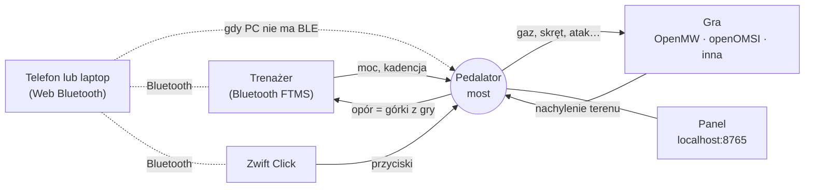

<div align="center">

# Pedalator

**Pedałuj po grach.** Użyj inteligentnego trenażera jako kontrolera: Twoje pedałowanie porusza postać lub pojazd w grze, a wzniesienia w grze zwiększają opór trenażera.

[](LICENSE)


*Panel z symulowanym kolarzem (`pedalator --simulate`) — żeby go wypróbować, nie potrzeba żadnego sprzętu.*

[English](README.md) · [Szybki start](docs/quick-start.md) · [Dokumentacja](#dokumentacja) · [Plany](docs/roadmap.md)

</div>

---

## Co to robi

- **Pedałowanie to gaz.** Moc z trenażera Bluetooth napędza grę: im mocniej pedałujesz, tym szybciej idziesz lub jedziesz.
- **Górki oddają.** Gra mówi Pedalatorowi, jak stromy jest teren, a trenażer to symuluje: podjazdy robią się ciężkie, zjazdy lekkie.
- **Skręcasz kontrolkami Zwift Click.** Małe kontrolery Bluetooth dołączane do trenażera obracają postać, patrzą w górę i w dół, atakują, skaczą, wyciągają broń lub używają przedmiotów.
- **Bez specjalnego sprzętu w PC.** Z adapterem Bluetooth 5 komputer sam czyta trenażer i Click. Jeśli Bluetooth w Twoim komputerze nie dogada się z trenażerem, robi to telefon albo laptop z Chrome ([tryb telefonu](docs/phone-mode.md)).
- **Panel** pokazuje moc, kadencję, prędkość, nachylenie, historię z dwóch minut i podgląd debugowania, a także pozwala wybrać, jak łatwa ma być jazda.

> Powstało podczas jazdy po **Morrowindzie** w [OpenMW](https://openmw.org) i na rowerze w symulatorze autobusu [openOMSI](https://github.com/openOMSI-Project/openOMSI), na trenażerze Van Rysel D500 — i jest otwarte na każdą grę, którą da się podłączyć.

## Co działa dziś

| | Sprawdzone na prawdziwym sprzęcie | Powinno działać, nie sprawdzone |
|---|---|---|
| **Trenażer** | Van Rysel D500 (Bluetooth FTMS) | Każdy trenażer Bluetooth FTMS, który przyjmuje symulowane nachylenie |
| **Kontroler** | Zwift Click v2 (oba krążki) | Zwift Click v1 (dwa przyciski: skręt), Zwift Play / Ride |
| **Gra** | OpenMW 0.51 (Morrowind) · openOMSI 0.1.6 (autobus, rower) | Dowolna gra sterowana klawiaturą ([cel `keys`](docs/games/keys-and-udp.md)); dowolna gra, która potrafi UDP ([cel `udp`](docs/games/keys-and-udp.md)) |
| **PC** | Windows 10 | Windows 11. Wysyłanie klawiszy działa na razie tylko w Windows |
| **Tryb telefonu** | iPhone (iOS 18) z przeglądarką Bluefy · laptop z Windows i Chrome | Android z Chrome |

Pedalator to **oprogramowanie w wersji alfa**: autorowi działa na co dzień, ale spodziewaj się zadziorów. Jeśli coś nie działa, otwórz zgłoszenie.

**Najbliższe plany** ([roadmapa](docs/roadmap.md#next-up)): tryb mieszany (trenażer w PC, Click na laptopie), profile z konfigurowalnymi klawiszami do importu i eksportu, kreator dodawania nowej gry.

## Jak to działa



**Most** (`python -m pedalator`) jest pośrodku: czyta trenażer, decyduje, co dostaje gra, i odsyła nachylenie z gry do trenażera. Sposób rozmowy z grą zależy od gry — zobacz [Architekturę](docs/architecture.md).

## Szybki start

Potrzebujesz Pythona 3.10+ oraz, dla roweru w OMSI, dodatku HafenCity (zobacz [openOMSI](docs/games/openomsi.md)).

```bash
git clone https://github.com/arielkuzminski/pedalator
cd pedalator
python -m venv .venv && .venv\Scripts\activate      # opcjonalnie, ale schludnie
pip install -r requirements.txt
```

**1. Rozejrzyj się bez sprzętu**

```bash
python -m pedalator --simulate
```
Otwórz <http://127.0.0.1:8765>. Zmyślony kolarz sprintuje i odpoczywa; wypróbuj tryby jazdy i suwak oporu.

**2. Morrowind w OpenMW**

```bash
python -m pedalator install openmw          # kopiuje moda i włącza go w openmw.cfg (z kopią zapasową)
python -m pedalator --target openmw         # PC rozmawia z trenażerem przez Bluetooth LE
# a jeśli Twój PC tego nie potrafi:
python -m pedalator --target openmw --remote   # i wykonaj kroki trybu telefonu z konsoli
```
Uruchom OpenMW, wczytaj zapis i pedałuj. Szczegóły: [przewodnik OpenMW](docs/games/openmw.md).

**3. Rower w symulatorze autobusu openOMSI**

```bash
python -m pedalator install openomsi --game-dir "C:\sciezka\do\openOMSI"
python -m pedalator build-bike --hafencity "...\Vehicles\HC_Fahrrad" --game-dir "C:\sciezka\do\openOMSI"
python -m pedalator --keys
```
Szczegóły: [przewodnik openOMSI](docs/games/openomsi.md).

**4. Inna gra**: Pedalator może naciskać klawisze gry (`--keys`) albo wysyłać JSON przez UDP do Twojego moda: [klawisze i UDP](docs/games/keys-and-udp.md).

## Tryby jazdy

Gra bez przerzutek to ciężka praca, więc są trzy tryby (przełączasz je w panelu w trakcie jazdy):

| Tryb | Pełny gaz od | Górki, które czujesz |
|---|---|---|
| **Łatwy** (domyślny) | ~125 W | 40 % |
| **Średni** | ~180 W | 70 % |
| **Realistyczny** | 250 W | 100 % |

Dwa suwaki pozwalają dostroić *wzmocnienie mocy* i część górek z gry, którą symuluje trenażer.

## Zwift Click w OpenMW

| Przycisk | Akcja |
|---|---|
| ◀ / ▶ (lewy krążek) | obrót w lewo / w prawo |
| ▲ / ▼ | patrz w górę / w dół |
| **B** (dół prawego krążka) | atak (przytrzymaj dla mocnego ciosu) |
| **A** | skok |
| **Y** | wyciągnij / schowaj broń |
| **Z** | użyj / otwórz / weź / rozmawiaj (naciska klawisz *użyj* z gry, domyślnie `E`) |
| **−** / **+** | mniej / więcej górek z gry na trenażerze (trudność) |

Więcej w [Zwift Click](docs/zwift-click.md).

## Dokumentacja

Dokumentacja jest po angielsku; poniższe odnośniki prowadzą do niej.

| | |
|---|---|
| [Szybki start](docs/quick-start.md) | pierwsza jazda w kilka minut |
| [Tryb telefonu](docs/phone-mode.md) | iPhone, Android lub laptop jako radio Bluetooth; jednorazowy krok z certyfikatem |
| [OpenMW / Morrowind](docs/games/openmw.md) · [openOMSI](docs/games/openomsi.md) · [Klawisze i UDP](docs/games/keys-and-udp.md) | konfiguracja gier |
| [Zwift Click](docs/zwift-click.md) | przyciski, jak działa protokół |
| [Architektura](docs/architecture.md) | kanały, porty, formaty plików |
| [Rozwiązywanie problemów](docs/troubleshooting.md) · [FAQ](docs/faq.md) | gdy coś jest nie tak |
| [Plany](docs/roadmap.md) | gry i funkcje na przyszłość (mile widziana pomoc!) |
| [Rozwój](docs/development.md) · [Współtworzenie](CONTRIBUTING.md) | testy, układ kodu, dodawanie gry |

## Ograniczenia

- Alfa. Sprawdzone na jednym trenażerze, jednym kontrolerze, dwóch grach i jednym PC. U Ciebie może być inaczej.
- Bezpośredni Bluetooth wymaga adaptera, który potrafi być *centralą* BLE. Wiele starszych PC nie potrafi — użyj [trybu telefonu](docs/phone-mode.md) albo adaptera USB Bluetooth 5.
- Wysyłanie klawiszy (cel `keys` i „użyj" w OpenMW) działa na razie tylko w Windows.
- Rower do OMSI wymaga płatnego dodatku HafenCity; Pedalator buduje go z *Twojej* kopii i nigdy nie dołącza jego plików.
- Tryb telefonu wymaga jednorazowej instalacji certyfikatu na telefonie, bo Web Bluetooth działa tylko na bezpiecznych stronach. Zobacz [uwagi o bezpieczeństwie](SECURITY.md).

## Podziękowania

- [OpenMW](https://openmw.org) i [openOMSI](https://github.com/openOMSI-Project/openOMSI) — gry, od których to się zaczęło. Pedalator nie zawiera kodu żadnego z nich.
- [BikeControl](https://github.com/OpenBikeControl/bikecontrol) — punkt odniesienia dla tego, jak kontrolery Zwift rozmawiają przez Bluetooth. Kodu BikeControl tu nie użyto; dekoder przycisków napisano niezależnie i sprawdzono na prawdziwym kontrolerze.
- [Bluefy](https://apps.apple.com/app/id1492822055) — przeglądarka, dzięki której Web Bluetooth działa na iPhonie.
- GTBikeV — mod do GTA V, który pokazał, że ten pomysł działa.
- Specyfikacja *Fitness Machine Service* Bluetooth SIG.

Pedalator to niezależny projekt, **niezwiązany z** Zwift, Decathlon / Van Rysel, Bethesdą, M&R Software, Aerosoft ani z projektami OpenMW i openOMSI i niepopierany przez nie. Wszystkie nazwy produktów należą do ich właścicieli.

## Licencja

[MIT](LICENSE) — za darmo dla każdego, do dowolnego użytku. Pomoc mile widziana: zobacz [CONTRIBUTING.md](CONTRIBUTING.md).
